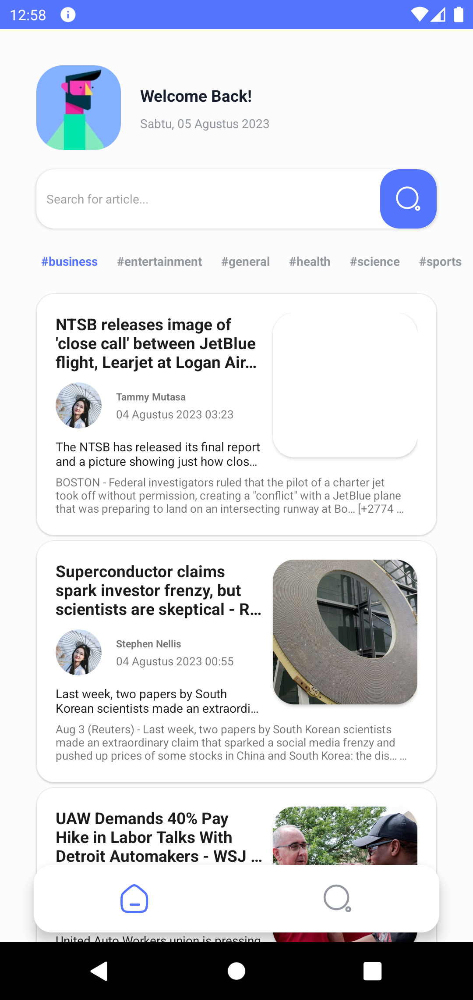
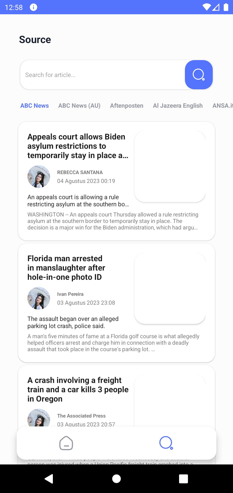

# NewsApp Android Sample

## About App
This app uses MVVM, clean architecture and [NewsAPI](https://newsapi.org/) to get various sources and each source can provide major headlines.
It uses [Retrofit 2](http://square.github.io/retrofit/) to fetch news sources and news headlines from the API and displays in a RecyclerView.
The main aim of this sample app is show how do i develop an android app using kotlin.

## If you want to run:
- Go to [NewsAPI](https://newsapi.org/) and generate an API key
- Put the API key at the bottom of the `build.gradle` module level.

`
buildConfigField "String", "API_KEY", '"YOUR_API_KEY"'
`
- Run the app

## Architecture

--------------------

## Screenshots

  
  

--------------------

## Future Roadmap
- Offline functionality using Room & Diffutil
- Work Manager for login/signup & in-app Push notification
- Profile settings
- Support for Launguage, Country and Category selection
- ~~Write test cases~~
